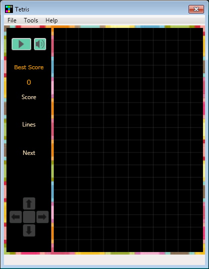
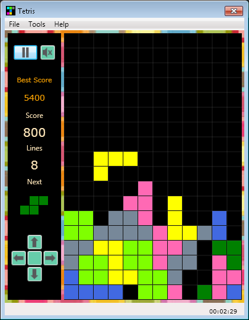
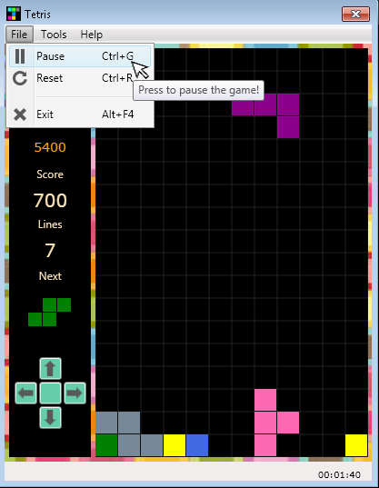
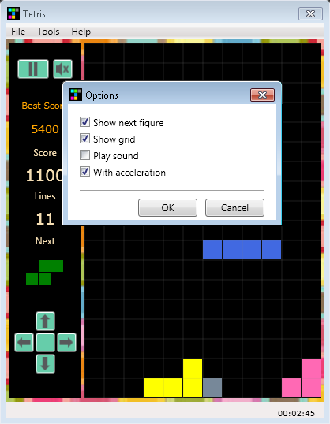
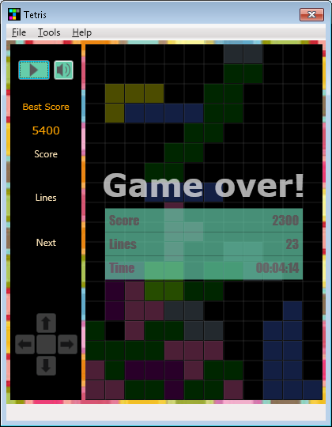

# Tetris #

Tetris is a tile-matching puzzle game, originally designed and programmed by 
Russian game designer Alexey Pajitnov.

### Details ###

It is game where you have to manipulate falling blocks to create lines.
The objective of Tetris is to complete full solid lines (no gaps). 
When you make a line it disappears and all the blocks shift accordingly.
The resulting design was a game that used seven distinctive geometric playing 
pieces - Tetriminos, each made up of four squares. Pajitnov called this game 
“Tetris,” a combination of “tetra” (the Greek word meaning “four”) and “tennis” 
(his favorite sport).
The scoring formula for the majority of Tetris products is built on the idea 
that more difficult line clears should be awarded more points. For example, 
a single line clear in Tetris Zone is worth 100 points, clearing four lines at
once (known as a Tetris) is worth 800.

### Why I wrote this app? ###

I have been "away" from programming for a while, due to several factors and reasons, such 
as (1) birth of my son (who is almost 5 years old now), (2) moving to a new country, 
(3) learning a new (Dutch) language and studying for obligatory integration exams. 

At the moment I'm "refreshing" my knowledge and skills. Writing apps like this seems 
the best way to do so.

I have a bachelor degree in Software Engineering, Master's degree in Information 
Technologies and work experience using C#/.NET, Adobe LifeCycle and JavaScript. 
See my CV for a full list of my knowledge set and skills.

If you are a company looking for (female) developers in Groningen area (the Netherlands), 
do not hesitate to [contact me](mailto:anahit.gardishyan@gmail.com).

### How to run? ###

See the Release directory for the release version.

### How do you play? ###

*  Get a Tetris game to play. ...
*  Start the game. ...
*  Move the tetrominoes left and right with the "Left" and "Right" arrow keys or buttons. ...
*  Understand the different tetrominoes. ...
*  Use the "Up" and "Down" arrow keys or buttons to rotate the tetrominoes to fit holes. ...
*  Complete lines to gain points.

### Screen shots ###

**Main application screen**

**Game in process**

**File menu**

**Options**

**Final result**

### License ###

[MIT License](LICENSE.txt)

### Author ###

Anahit Gardishyan [anahit.gardishyan@gmail.com](mailto:anahit.gardishyan@gmail.com)
